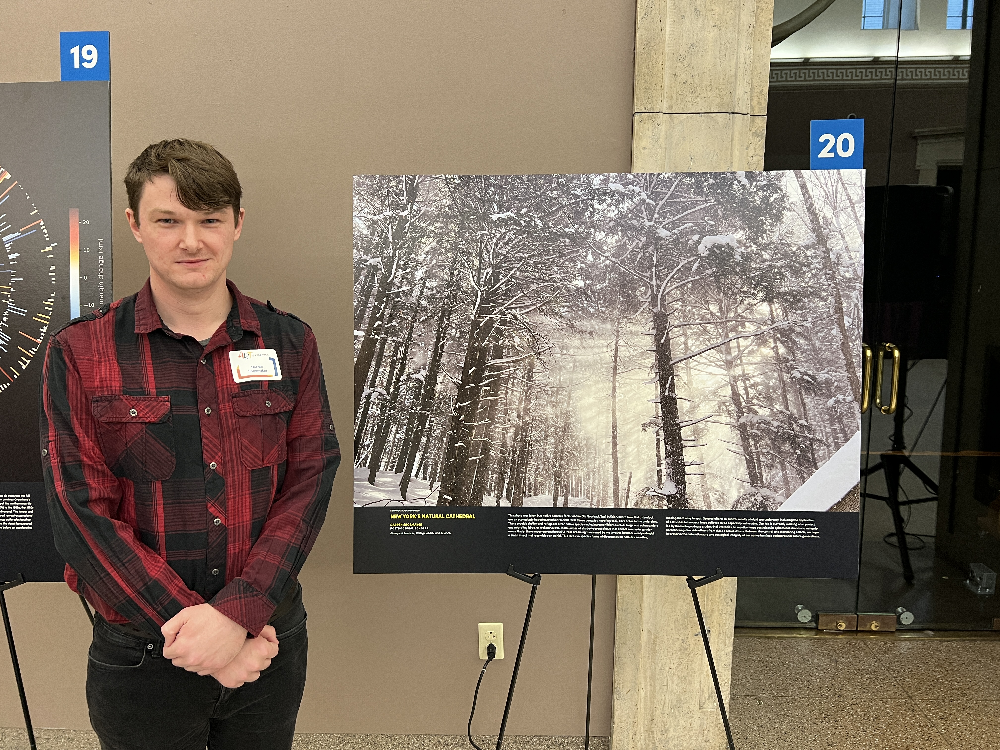

{fig-align="center"}

The University at Buffalo [Art of Research competition](https://www.buffalo.edu/art-of-research) is an annual event for graduate students and postdocs to present an image representative of their research to fellow scholars and the general public. I presented a photo I took while assisting an undergraduate honors student with his field work during winter 2025.

{fig-align="center"}

This photo was taken in a native hemlock forest on the Old Scarbuck Trail in Erie County, New York. Hemlock are an ecologically important native tree that form dense canopies, creating dark areas in the understory. These provide shelter and refuse for other native species including amphibians such as frogs and salamanders, migrating birds, as well as unique communities of shade-tolerant plants that cannot survive in sunnier areas. Sadly, these important and beautiful trees are being threatened by the invasive hemlock woolly adelgid, a small insect that resembles an aphid. This invasive species forms white masses on hemlock needles, making them easy to spot. Several efforts to control woolly adelgid are udnerway, including the application of pesticides to hemlock trees beleived to be especially vulnerable. Our lab is currently working on a project led by the undergraduate student Hal Svetanics to monitor these pesticides in ephemeral streams to mitigate potential negative side effects from these control efforts. Between the control and monitoring, we hope to preserve the natural beauty and ecological integrity of our native hemlock cathedrals for future generations.