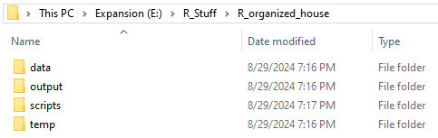
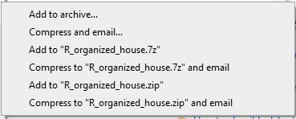
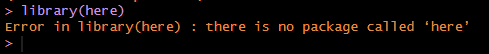
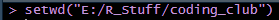

::: {.callout-note}
## Note
This content was originally published as a part of the MSU WFA Coding Club and my tools and process have evolved somewhat since then. However, I stand by the philosophy of this post, and the strategies described here are still a good starting point for beginners looking to be more thoughtful about their data science projects. 
:::

# Introduction

Today we're going to discuss how to share code with your committee or collaborators. An unfortunately frequent event during graduate school is to spend weeks or months developing a script, share that script with your committee member, and the script fails when they try to run it. What happened? It worked perfectly yesterday! As always, my solution is not the only solution, so if you find something which works better, absolutely do that (and maybe tell me so I don't keep doing stuff the hard way). The idea is that your collaborator(s) should be able to simply click run on a .R script and obtain the same output as you.

A useful heuristic I like is to ask myself, "Would my friend be able to run my script on their laptop at our Arctic research base?" If the answer is yes\*, you're already done, but if you're not sure, keep reading!

\*If you are working with extremely large files or computationally intensive tasks, their laptop may not be able to run the script anyway, so assume a relatively normal analysis.

## \[1\] Working in Projects

The easiest way to collaborate is to work inside of an intuitively named R Project using a .Rproj file. I wrote a simple guide on using R Projects which you can [read here](https://thedungeonecologist.github.io/darrenshoemaker/posts/staying_organized/). Remember that a project is a self-contained directory which should contain all the components needed to run an analysis. In general, I keep data, output, scripts, and temp folders inside project directories, but adapt this to your own needs.

{fig-align="center"}

Projects are helpful for collaboration because the entire project can be shared as a .zip file. I personally use the program 7-zip to create zip files, but Windows has a native function. Right click on the project directory and click Add to \[PROJECT_NAME.zip\]. I am going to use R_organized_house from the staying organized guide as an example.

{fig-align="center"}

You should end up with a .zip archive with the same name as your project directory.

{fig-align="center"}

This is the folder you will share with your collaborators. Remember they will need to unzip the folder before they can start working with your project.

## \[2\] Packages and Libraries

The .R script file you actually them to run should be inside the zipped archive. Once they unzip the folder, they can open the .Rproj file in their own local RStudio environment.

This guide requires the here() library. As with all libraries, they have to be loaded before we can use the functions in them. You have almost certainly used the line library(\[PACKAGE_NAME\|) in a script before.

## Libraries

Begin every script with a code chunk which loads the necessary libraries. This will ensure whoever runs the script after you will be able to access the functions you use.

```{r}

# Libraries

library(here)
```

Depending on if you've used here() before, you may see the following error.

{fig-align="center"}

For the sake of argument, we'll assume our friend in the Arctic has not used the here() library and does receive the error. This means the script has already failed before we have begun any analysis or even loaded our data.

This means the user has not installed the package. This brings us to a crossroads so I'm going to get on a soapbox: As a general rule, I do not want my scripts to modify the end users' computer. This means I do not want to install new software or write new files. If your collaborator trusts you, and I hope they do, they probably won't care, but I think this is best practice from a coding, data management, and privacy perspective. However, without installing the package, the script won't work.

My workaround is to provide the installation code but commented out. The user can use their own due diligence and review if they want to install the package, and that the install.packages() function will be skipped over if they already have the package and installation is unnecessary. This will look something like the following code chunk.

```{r}
#| output: false

# Install Packages

#install.packages('here')
#install.packages('ggplot2')

# Libraries 

library(here)
library(ggplot2)
```

## \[3\] Reading in Data

Once our friend has loaded the appropriate libraries, they need to access any data read in by the script. A common trap is to use the function setwd() to access files.

{fig-align="center"}

This works fine on my computer. The issue is E: is my external hard drive, R_Stuff keeps backups of my work, and coding_club is a local directory I use for the website. My friend has none of these folders! This means any script which uses this line will only work exactly on my computer and if I don't change anything about my folders. Unlikely!

The here() package is my preferred method for accessing a working directory in a collaborative setting. This package works by automatically (magically) setting the working directory to the highest folder associated with the R Project. This works by looking for .Rproj, .gitignore, or another high-level file which applies to the entire project. This should occur as soon as the library is loaded, but you can double check by calling the here::here() function.

```{r}
here::here()
```

This function will identify where the term "here" is referring to. In my case, this is the coding_club folder I used to build this website.

For the purposes of this example, I am going to read in the filtered virginca_processed .csv which we made in the Staying Organized guide. Another good practice is to use head(), str(), or your preferred summary function to make sure the dataframe you read in looks like what you expect.

```{r}
dat <- read.csv(file = here('posts/codingcollaboration/data', 'virginica_processed.csv'))
head(dat)
```

This looks like the iris dataset filtered to only include the species *virginica*. This is what I expected, so we're ready to move on.

## \[4\] Using the Data

If we have done everything described above correctly, our friend in the Arctic should now have the filtered iris dataframe, named dat, in their R environment. Sharing the data and files associated with an R script or project is probably 90% of the battle, so take a deep breath.

As an example, we're going to make a couple plots using these data in the ggplot package, but substitute any analysis you want to share.

```{r}
plot_1 <- ggplot2::ggplot(data = dat, mapping = aes(x = Petal.Width, y = Petal.Length, fill = Species)) +
  geom_point(color = 'blue') +
  xlab('Petal Width') +
  ylab('Petal Length') +
  ggtitle('Length and Width of Virginica Petals in Sample')

plot_1

plot_2 <- ggplot2::ggplot(data = dat, mapping = aes(x = Sepal.Width, y = Sepal.Length, fill = Species)) +
  geom_point(color = 'blue') +
  xlab('Sepal Width') +
  ylab('Sepal Length') +
  ggtitle('Length and Width of Virginica Sepals in Sample')


plot_2
```

## \[5\] Saving Outputs

Similarly to installing packages, I don't like writing new files to another user's computer. Still, many researchers will want to be able to access output files after running a script. I always try to provide the code to get the output, but again commented out. You may just want to reach out to your collaborators to clarify their preferences if the commented codes are annoying.

```{r}

#ggsave(plot_1, file = here('output', 'plot_1.png'), dpi = 300)
#ggsave(plot_2, file = here('output', 'plot_2.png'), dpi = 300)
```

Again, the here() function lets us write the files to the output folder contained in the project directory. This means the images are written to the same place no matter who runs the script.

## \[6\] General Best Practices for Shared Scripts

Congratulations! If you've made it this far, you should be able to write a script anyone can run. This section just adds a few extra tips which may be helpful. I will update this section relatively frequently so feel free to share anything you want added.

### 1. Comment Thoroughly

Just because your friend is able to run the script, it may not be immediately clear what each section of the script is doing. I recommend adding comments to the code to guide them through what each major section does. This will also be helpful to you in the future if you have to revisit an old project.

```{r}
# Read data

## Generate plots

# Mixed effects modeling for fish abundance ----

#' The output from this model suggests water temperature has a positive effect on fish abundance. 
```

There are a few strategies to commenting. You don't need to write a research paper in the script, but some guidance can clarify complex code. Different types of comments only marginally change the script, but can affect the output if you knit the script into a different document.

The number of \# symbols indicate the level of header. Incidentally, the Introduction header of this page uses #, each section uses ##, and the subsections in \[6\] use ###.

Adding the four minus signs after a comment will turn that into a section which can be accessed from the outline button in the top right of the script window. This is useful if your script is very long.

The apostrophe after the last comment indicates that this is a roxygen comment. This won't change anything here, but indicates the comment should be treated as plain text in an HTML or PDF document.

### 2. Call Functions Explicitly

You may have noticed the double colon operators before some of the functions above.

::

This operator is used before calling a function to explicitly define the package namespace of that function. In our case, we used the following.

```{r}
#| eval: false

ggplot2::ggplot()
here::here()
```

This operator indicates to R that we want to use the ggplot() function from the ggplot2 package. In some cases, multiple functions from different packages may have the same name. This means that one will *mask* the other. R will provide a warning when you load libraries which share package names, but this is easy to miss.

We probably don't know every package our friend has installed on their machine. By using the :: operator, we can make sure every function is running from the correct package. This may also save some headache if you accidentally mask a function down the road.

## \[7\] Sharing the Project

With that, you should be prepared to share your analysis with your committee or collaborators! Hopefully they respond in a timely manner. Once you have everything in a .zip archive, you can share through email, a thumb drive, OneDrive/cloud service, or maybe even GitHub. As always, thank you for reading and please reach out with any feedback!