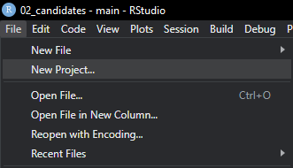
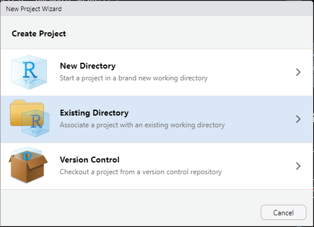
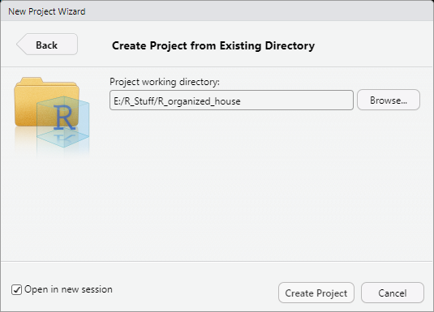
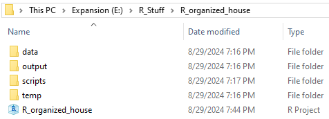
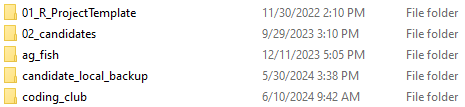

::: {.callout-note}
## Note
This content was originally published as a part of the MSU WFA Coding Club and my tools and process have evolved somewhat since then. However, I stand by the philosophy of this post, and the strategies described here are still a good starting point for beginners looking to be more thoughtful about their data science projects. 
:::

# Introduction

One of (in my opinion) the most useful and least-taught skills one can develop is how to stay organized in R. Here, I am going to present my technique for keeping my projects organized. As you read this, keep a few points in mind. This is neither the only nor the best strategy, so if this does not work for you, try something else. The most important thing is an organization system works for you and that you apply it consistently. If you start making exceptions or deviate from your system, you may not be able to find something later.

Two notes:

1\) This guide will assume some familiarity with .R and .csv files and Windows folder system. If you are using a MacOS, this should translate pretty easily. If you are using a Linux Machine, you probably don't need this guide.

2\) All of my other coding_club pages will follow this organizational structure, so I recommend reading this one first.

### Why is this so important?

Short answer: It may not be. Decide for yourself if devoting time up front will be worth the time you save down the road.

Long answer: As you use R more for classes, theses, and projects, you will find yourself making dozens to hundreds of scripts with all the associated data, outputs, and objects associated with each. If you, or better yet, your R environment, knows where to find everything it needs to function, you will save yourself time and headaches when you need to access these again. In academia and science, it is fairly common to step away from a project for months or even years at a time. The more detailed your organizational system, the easier it will be to pick these projects back up.

## Step 1: Everything Needs a Home

Start by making a folder for all of your R stuff. Everything we do from this point on will happen inside this folder. R is a programming language which means it is very particular about how commands are entered. One aspect of this is that R does not like spaces. Always place an underscore \_ or other character between terms. I will literally name this file R_Stuff. You can't get more descriptive than that. If you like clumsy allegories, call R_Stuff our house.

## Step 2: Maintaining a Consistent Folder Structure

Start by making a folder inside of R_Stuff. This can be anything, but remember the name can't have any spaces. The name should also be descriptive. Someone who is not familiar with the folder or its contents (read: you in a couple months) should reasonably be able to guess what the folder contains. Consider this a room inside the house.

{fig-align="center"}

So, anyone who clicks on this folder will expect to see files related to a project called organized house.

Inside R_organized_house, we're going to make a few more folders. These can also be named anything. You want them to be descriptive enough to make their contents clear, but general enough to reuse for multiple projects. I like, at minimum, including data, output, scripts, and temp folders. Think of these as desks or closets in the room.

{fig-align="center"}

Inside data, we're going to go one step further and add a raw and processed folder. The raw data folder is the junk drawer. We can toss whatever into here without really thinking. The processed folder is tool drawer, which is hopefully more organized. We'll write cleaned data to this folder.

{fig-align="center"}

## Step 3: The R Project File

Finally, are ready to move into R. Begin by opening RStudio. If you feel the need, you can cry a bit. This is a healthy emotional release and R is scary. Once you're ready, move to the file tab and click New Project.

{fig-align="center"}

The R Project is one of the most powerful tools for organization, but rarely mentioned in statistics courses. This is not the fault of the instructors - those courses are already packed with more material than can be reasonably taught. An RStudio project is associated with your working directory and creates a shortcut to open everything in that directory in your RStudio session.

In the next menu, click Existing Directory. New Directory is also fine, but we already set up our file structure. Version Control is the scary basement. Stay out of the basement.

{fig-align="center"}

Navigate to the folder you made previously. In our case, this is R_organized_house. Best practice is check open in new session. This is not completely necessary, but you probably don't want anything from your current environment being used in the new project.

{fig-align="center"}

After you click create project, you'll see a .Rproj file in the directory you picked.

{fig-align="center"}

The .Rproj file is the foundation of the organization system we're using here. Whenever you want to work on your project, open Rstudio by clicking on the .Rproj file. In this case, R_organized_house. This will ensure you are working within that project directory, and any files or output you generate will stay in this folder.

## Step 4: Working with Scripts and Data

Once you have a project set up, you're finally to begin working! A .R script is is probably the most fundamental file type to the R programming language. Any scripts you make will have a .R file extension. To take full advantage of the folder structure we made, we're going to use the here library. This is a powerful library for collaboration and we will only be scratching the surface of its functionality. Install the package if needed, then load the library.

The here package automatically sets the working directory to the highest folder in the project. The package begins working as soon as you load the library, but you can also call the here::here() function if you want to set the working directory manually. The function works by looking for a .Rproj file, .gitignore file, and a few others. Conveniently, we have a .Rproj file at the main folder, so the working directory above is set to coding_club. As you are probably working with a different folder name, double that this is set correctly.

### The here library

```{r}
library(here)
```

Because we set the working directory using here(), we have to use the here() function when reading or writing data. This may seem like an extra step, but I promise will save time in the long run. We will use the famous Iris dataset for this example. Iris is pre-loaded into R, but we will read it as a .csv file from the raw data folder.

```{r}
data <- read.csv(file = here('data/raw', 'iris.csv'))
```

This is a bit more complicated than the usual read.csv(), so let's break it down. We're creating a data object as normal, but we have to tell R where to look for the file since we didn't use set.wd(). To do this, we add the here() function to the file argument, and tell R that the file is inside the 'data/raw' folder. Because the data is in a folder inside a folder, we have to add the / between data and raw to indicate the file path. Finally, we name the file to tell R which file we want assigned to the object 'data'.

```{r}
head(data)
```

We're going to make a simple change to the iris dataset for the purposes of this example. First, load the dplyr library and make a modification.

```{r}
library(dplyr)

data <- data %>% 
  filter(Species == 'virginica')

head(data)
```

### A Note on Filtering

The filter() function may be new so we'll walk through that. We start with the data object we made earlier, then we're going to use the pipe operator, &\>&. The pipe operator is just a way to tell R to do something and then do something else. Here, we're telling R to take the data object "and then" apply the filter function. The filter function tells R to take all the Species which are exactly equal ( == ) to virginica, so we make a new data object which only includes virginica.

## Step 5: Using the Output and Temp Folders

Let's go back to the house analogy. We're still in the same room, the R_organized_house folder, but we want to put the data object somewhere else, maybe taking it out of the junk drawer and putting it somewhere more sensible. To do this, we're going to use the here() function along with the folder structure we made at the beginning.

```{r}

write.csv(data, file = here('output', 'virginica_output.csv'), row.names = F)

write.csv(data, file = here('temp', 'virginica_temp.csv'), row.names = F)

write.csv(data, file = here('data/processed', 'virginica_processed.csv'), row.names = F)
```

We actually wrote the same file to three different locations. In practice, you probably wouldn't do this, but we can demonstrate the flexibility of the this approach. Because we're using the here() function, we don't need to set the working directory or write the entire file path. We just say that we're here(). Conveniently, this is the top level folder, so what we're really telling R is to make a .csv file here, inside either the output, temp, or data/processed folder. Typically, you would write results or tables to the output folder, something more experimental or exploratory to the temp folder, and a finalized, clean to dataset to the processed folder. This approach is also flexible, so you can add folders as needed. Maybe you want a folder for rasters inside of the data folder, or you want to sort your outputs more. Adapt as needed.

## The Next Steps: the Project Template

So you've made one project, but your next class assignment is coming up and you want to make another folder. To keep the analogy, move to a different room, but that was a lot of effort. We're going to make a project template to save a few steps. Make a new folder inside of R_Stuff. Mine is named project_template, but pick a name that works for you. I also lead with the digits 01, so the folder is always at the top of the R_Stuff directory.

{fig-align="center"}

Inside of this folder, make data, output, scripts, and temp folders, or whatever you folders you want in all or most of your projects. These should generally be empty, but if you have many projects which share a dataset, you may want to add these to the data/raw folder. From here, any time you want to make a new project, you can just copy the entire template folder, change the name to your new project, and then make a project with the new folder as the directory. I go one step further and also keep a read_data script in the scripts folder of the template, which saves me typing a few lines.

```{r}
#| eval: false

#' ---
#' title: "Read Data"
#' author: "Darren Shoemaker"
#' ---

# Libraries 

library(here)
library(tidyverse)

#read in data ----

dat <- read.csv(file = here('data/raw', ''))
```

## Congratulations!

This is a basic rundown of how I keep my R projects organized. I hope this was helpful! If something is missing or unclear, please let me know. I want to make these as practical and useful as possible, so I appreciate your feedback. Now go do some great science!